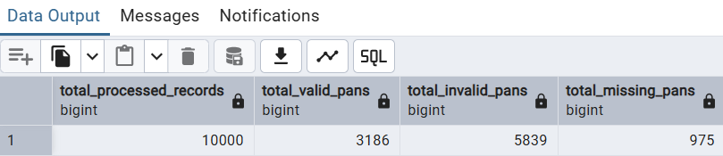

# PAN-Number-Validation-Data-Cleaning

  A SQL-based data cleaning and validation project for Indian Permanent Account Numbers (PAN). This project processes a dataset of 10,000 entries, cleans incomplete or malformed data, and validates PAN numbers against official Indian income tax rules.

---

DATASET : [PAN NUMBER DATASET](PAN_Number_Validation_Dataset.csv)


***Tools Used***: PostgreSQL

Final SQL Script : [Project_script](project_scripts.sql)

---

**1. Project Overview & Rules**:


**What is a PAN?**

- PAN stands for Permanent Account Number.

- It's a 10-digit unique alphanumeric identifier issued to Indian taxpayers.

- The project involves cleaning and validating a dataset of these numbers.

---

**Data Cleaning Rules:**

1.**Handle Missing Data**: Identify and remove entries where the PAN number is blank or null.

2.**Remove Duplicates**: Ensure each PAN number entry is unique.

3.**Trim Spaces**: Remove any leading or trailing spaces from the PAN number entries.

4.**Standardize Case**: Convert all PAN numbers to UPPERCASE.

---

**Validation Rules (The PAN Format):**


A valid PAN must adhere to the following structure: AAAAA1111A

- First 5 Characters: Must be uppercase letters (A-Z).

- Next 4 Characters: Must be digits (0-9).

- Last Character: Must be an uppercase letter (A-Z).

*Additional Validation Rules*:

For the first ***5 letters***:

- Rule 1: No two adjacent characters can be the same (e.g., AABCE is invalid, AXBCE is valid).

- Rule 2: All five characters cannot form a sequential pattern (e.g., ABCDE, BCDEF are invalid; ABCXE is valid).

For the next ***4 digits***:

- Rule 1: No two adjacent digits can be the same (e.g., 1123 is invalid, 1923 is valid).

- Rule 2: All four digits cannot form a sequential pattern (e.g., 1234, 2345 are invalid; 1239 is valid).

---

**Final Deliverables**:

1.*Detailed Report*: A list of all PAN numbers with a new column indicating their status as Valid or Invalid.

2.*Summary Report*: A high-level summary containing:

- Total records processed

- Total valid PANs

- Total invalid PANs

- Total missing/incomplete PANs

---

**2. Step-by-Step Implementation**

*1. Create a Staging Table*: Create a simple table with one column to hold the raw dat.
   
```

CREATE TABLE stg_pan_numbers_dataset (
    pan_number TEXT
);

```
*2. Data Cleaning*
The goal is to create a cleaned dataset by applying the four data cleaning rules. This is done in a single query using a Common Table Expression (CTE).

**Key SQL Functions Used**:

TRIM(): Removes leading and trailing spaces.

UPPER(): Converts text to uppercase.

DISTINCT: Removes duplicate records.

WHERE ... IS NOT NULL: Filters out null values.

***Cleaning Query***:

```
select distinct upper(trim(pan_number))
from stg_pan_number_dataset 
where pan_number is not null
and trim(pan_number) <> '';

```

***Result***: This query returns 9,025 cleaned, unique PAN numbers ready for validation.

*3. Data Validation*
Validating the complex rules requires creating custom User-Defined Functions (UDFs).

*A) Create Function*: Check for Adjacent Characters
This function checks if any two adjacent characters in a string are identical.

```

create or replace function fn_check_adjacent_chars(p_str text)
returns boolean
language plpgsql
as $$
begin
      for i in 1 .. (length(p_str) - 1)
	  loop
	     if substring(p_str, i, 1) = substring(p_str, i+1, 1)
		 then
		   return true; -- characters are adjacent
		 end if;
	  end loop;
	  return false; -- non of the characters adjacent to each other were same
end;
$$

```
**Usage**: SELECT fn_check_adjacent_chars('AABCE'); returns TRUE.
SELECT fn_check_adjacent_chars('AXBCE'); returns FALSE.

*B) Create Function*: Check for Sequential Characters
This function checks if all characters in a string are in sequential order (e.g., ABCDE) by comparing their ASCII values.

```

Ccreate or replace function fn_check_sequencial_chars(p_str text)
returns boolean
language plpgsql
as $$
begin
      for i in 1 .. (length(p_str) - 1)
	  loop
	     if ascii(substring(p_str, i+1, 1)) - ascii(substring(p_str, i, 1)) <> 1
		 then
		   return false; -- characters are not in sequence 
		 end if;
	  end loop;
	  return true; -- characters are in sequence
end;
$$

```

**Usage**: SELECT fn_check_sequential_chars('ABCDE'); returns TRUE.
SELECT fn_check_sequential_chars('ABCXE'); returns FALSE.

*C) Validate Format with Regular Expression*
Use a regex pattern to check the basic structure: 5 letters + 4 digits + 1 letter.

- ^[A-Z]{5}: Starts with exactly 5 uppercase letters.

- [0-9]{4}: Followed by exactly 4 digits.

- [A-Z]{1}$: Ends with exactly one uppercase letter.

**Pattern**: '^[A-Z]{5}[0-9]{4}[A-Z]$'

**4. Final Query for Valid/Invalid Categorization**

This query brings everything together: it uses the cleaned data, the custom functions, and the regex pattern to label each PAN as Valid or Invalid.

```

create or replace view vw_valid_invalid_pans
as
with cte_cleaned_pan as
 (select distinct upper(trim(pan_number)) as pan_number
  from stg_pan_number_dataset 
  where pan_number is not null
  and trim(pan_number) <> ''),
 cte_valid_pans as
  (select *
  from cte_cleaned_pan
  where fn_check_adjacent_chars(pan_number) = false
  and fn_check_sequencial_chars(substring(pan_number,1,5)) = false
  and fn_check_sequencial_chars(substring(pan_number,6,4)) = false
  and pan_number ~ '^[A-Z]{5}[0-9]{4}[A-Z]$')
select cln.pan_number
,  case when vld.pan_number is not null
            then 'Valid PAN'
		else 'Invalid PAN'
       end as status
from cte_cleaned_pan cln 
left join cte_valid_pans vld on vld.pan_number = cln.pan_number;

select * from vw_valid_invalid_pans;

```

**Result**: This query lists all 9,025 cleaned PANs with their validation status. 

 **5. Create the Summary Report**
This query calculates the totals for the final report. It uses the FILTER clause for clean aggregation.

-- Summary Report Query

```

WITH cte AS (
    SELECT
        (SELECT COUNT(*) FROM stg_pan_number_dataset) AS total_processed_records,
        COUNT(*) FILTER (WHERE status = 'Valid PAN') AS total_valid_pans,
        COUNT(*) FILTER (WHERE status = 'Invalid PAN') AS total_invalid_pans
    FROM vw_valid_invalid_pans
)
SELECT
    total_processed_records,
    total_valid_pans,
    total_invalid_pans,
    (total_processed_records - (total_valid_pans + total_invalid_pans)) AS total_missing_incomplete_pans
FROM cte;

```
**Result**:



Total Processed Records: 10,000

Total Valid PANs: 3,186

Total Invalid PANs: 5,839

Total Missing/Incomplete PANs: 975 (10,000 - (3,186 + 5,839))

---
